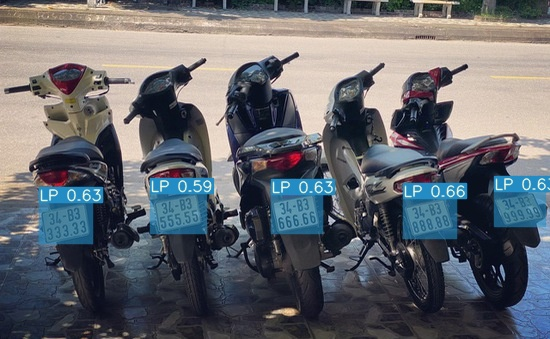

# LPRecognition
- Đây là một repository phụ cho dự án DN2AI (dự án khoa học kĩ thuật).
- Repository này chủ yếu là một project phụ nhằm phát hiện và đọc biển số xe với độ chính xác cao. Phục vụ cho dự án chính (phát hiện học sinh lái xe lớn hơn 50cc và chưa đủ tuổi).
- Với các thành viên của nhóm:
    + Võ Phương Nghi 11T1
    + Châu Nguyễn Thanh Duy 11L
## How It Works ?
- Nhận diện biển số xe theo các bước:
  + Xác định vị trí biển số xe dùng thuật toán <b>YOLOv7</b> (có thể dùng các phiên bản khác).
  + Phân đoạn kí tự (tách kí tự từ biển số xe).
  + Nhận diện kí tự đã được tách (OCR).

## Note
- (10/9/2023) Hoàn thành việc dùng model <b>YOLOv7</b> để phát hiện vị trí biển số xe. Đồng thời chỉnh sửa code để hiện background màu xanh. <br/>


- (19/9/2023) Dùng thư viện <b>EasyOCR</b> để đọc biển số xe. Tuy nhiên lại không cho ra kết quả chính xác, làm tôi rất thất vọng.<br/>

- (20/9/2023) Từ việc dùng thư viện <b>EasyOCR</b> để đọc biển số xe không hiệu quả, tôi quyết định chuyển sang <b>PaddleOCR</b>. Và thật tuyệt vời, nó cho ra các kết quả cực kì chính xác! Điều này làm tôi rất bất ngờ, LPRecognition gần như đã hoàn thành.<br/>


- (21/9/2023) Thành công việc đọc biển số xe, kiểm tra xem <b>PaddleOCR</b> đọc biển số xe có chính xác ? Và chỉ update khi chất lượng ảnh tốt hơn.
- (2/10/2023) Cho phép Project chạy mà không cần <b>SORT</b> (Object Tracking) vì thời gian cài đặt rất lâu (10 phút)
- (5/10/2023) Đã có thể sử dụng Webcam trên <b>Google Colab</b>, chuẩn bị cho việc thử nghiệm!

## Tutorial
### 1. Local
Nếu dùng trên máy bạn thì chạy Project như sau:
```
python3 detect.py --weights <name_weight> --source <source_file> --no-trace
```
Thay thế: ``<name_weight>`` và ``<source_file>`` thành file của các bạn (Có thể xem thêm file ``detect.py`` để có nhiều lựa chọn khác).

Nếu muốn dùng webcam thì thay ``<source_file>`` thành ``0``

### 2. Google Colab
Chạy trên Google Colab thì cũng tương tự nhưng thay ``python3`` thành ``!python``

Tuy nhiên, nếu dùng webcam trên <b>Google Colab</b> thì phải chạy file ``webcam_colab.py`` như sau:
```
%run webcam_colab.py 
```

Vui lòng xem file ``tutorial.ipynb`` để hiểu thêm!

## Todo
- [X] Nhận diện biển số xe qua hình ảnh
- [X] Đọc biển số xe với độ chính xác cao.
- [X] Nhận diện biển số xe qua video.
- [X] Nhận diện biển số xe real-time qua camera.

## Reference
```
WongKinYiu, https://github.com/WongKinYiu/yolov7
mrzaizai2k, https://github.com/mrzaizai2k/License-Plate-Recognition-YOLOv7-and-CNN
https://github.com/PaddlePaddle/PaddleOCR
```

